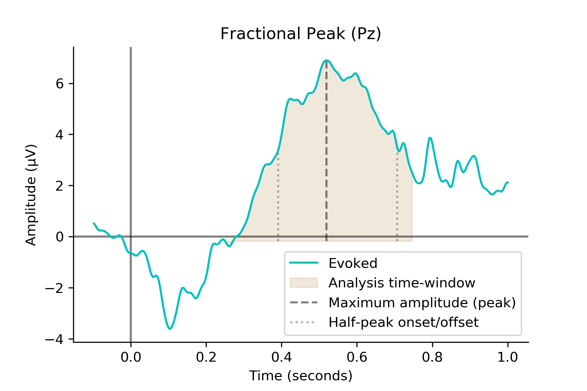
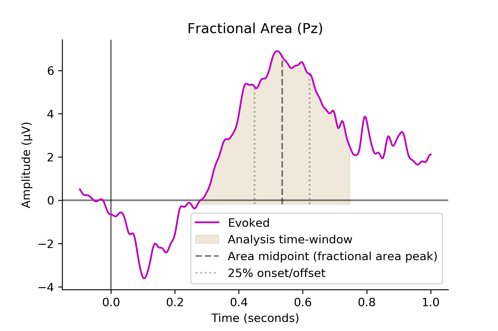

<h1> Find Latency Function </h1>

	Here is a small function to find latencies of amplitudes in event-related potentials (ERPs). This is inspired in the ERPlab measurement tool (https://github.com/lucklab/erplab/wiki/ERP-Measurement-Tool). Presently, the functions implemented are the fractional peak method, which uses the maximum amplitude within a pre-defined period (analysis time-window) as the wave peak and 50% of that peak amplitude is used as the wave onset/offset for analyses purposes. The second method uses the area under the curve (ERP wave), where 50% of that area (half way through 'horizontally') determines the amplitude peak (i.e. mid wave), and the first 25% of the area determines the onset of the wave (thus 75% determines the offset) for analyses purposes. Note that these methods may have many caveats (e.g. see Luck 2014), such as different degrees of sensitivity to noise, arbitrariness of time point comparisons, among others. Given that, time-series analysis may be a better tool for understanding the development of amplitude through time.   

<h1> Function </h1>

 The find_latency function takes six arguments, such as <strong>find_latency(evokeds, tmin, tmax, method, percents=None, out=None)</strong>, where <strong>evokeds</strong> corresponds to an MNE evokeds object, <strong>tmin</strong> and <strong>tmax</strong> are the starting and ending time of the analysis time-window respectively, <strong>method</strong> is the method for finding latency ('frac', 'area', 'area_pos', 'area_neg', 'area_frac'), <strong>percents</strong> requires a list of two values between 0 and 1 specifying the area percentages to find onset and offset (e.g. percents = [0.25, 0.75], default is None), and <strong>out</strong> specifies the function output ('dataframe' outputs a pandas dataframe, default is None and outputs a tuple) . The 'frac' method finds the peak as the maximum value and its 50% as latency onset/offset (fractionla peak), 'area' find the 50% fractional area as the peak and corrects for negative/poistive area depending on whether the average amplitude in the time window is positive or negative, 'area_pos' and 'area_neg' apply only positive or negative correction respectively, 'area_frac' finds the peak as 50% fractional area and uses the 50% of that peak as onset/offset (combination of fractional area and fractional peak). Fractions for finding onset/offset need to be manually specified, but the default is [0.25, 0.75], namely 25% fractional area. The method for computing the fractional area and corrections is based on this method: https://lindeloev.net/hej-verden/ , and corresponds to subtracting the product of the fraction and sum of the signal from the cumulative sum of the signal:

 ys = &Sigma;si=1xi,  s &isin; {1, 2, 3..., N} = S 

 argmin{abs{(&Sigma;si=1xi - min(S)) - (p&Sigma;Ns=1ys - min(S))}}, where p is a fraction (e.g. 0.5), and S is the set of ERP samples (e.g. 256 measurements in volts/microvolts if the epoch is 1s and sampling rate is 256Hz).

<h1> Application </h1>

 Below you can find the results of the function applied to a P3b ERP obtained from an oddball auditory task. The first image shows the fractional peak (50%) method applied to a window spanning 250-750ms (around the wider range of P3b from those usually observed in the literature), the peak is determined as the maximum amplitude within this range (dashed line) and onset(390ms) and offset(707ms) as the 50% of that peak amplitude. The second image illustrates the application of the fractional area method, using the point diving the area in half (50%) as the peak, 25% as the onset (450ms) and 75% offset (621ms). Note that the fractional area method finds onsets that are very close to the peak. 

	 
	

<h1> Conclusion </h1>

 The functions output sensible results, but may require more fine tuning. Some methods, such as integration (e.g. numpy.trapz) for finding the area under the curve were not included, under the assumption that present methods may suffice. However, this leaves plenty of room for additions improvement. 

